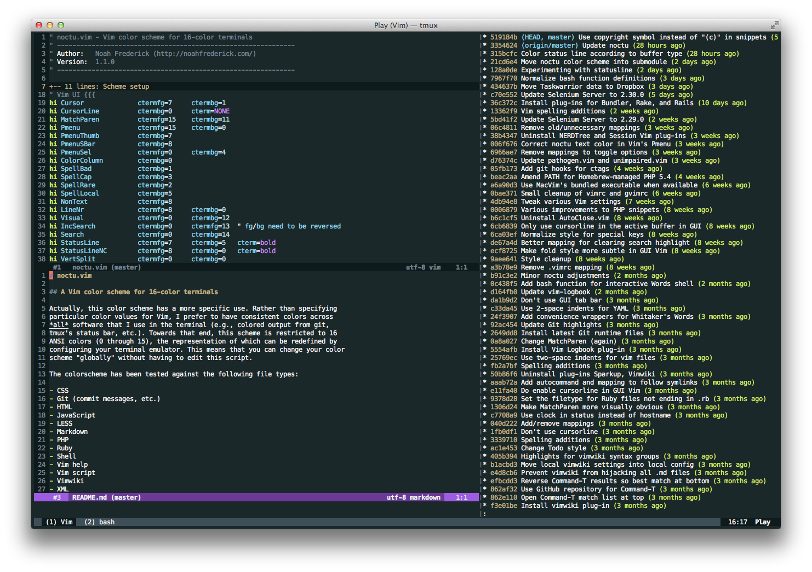

# noctu.vim

## A Vim color scheme for 16-color terminals

Actually, this color scheme has a more specific use. Rather than specifying
particular color values for Vim, I prefer to have consistent colors across
*all* software that I use in the terminal (e.g., colored output from git,
tmux's status bar, etc.). Towards that end, this scheme is restricted to 16
ANSI colors (0 through 15), the representation of which can be redefined by
configuring your terminal emulator. This means that you can change your color
scheme "globally" without having to edit this script.

The color scheme has been tested against the following file types:

- CSS
- Git (commit messages, etc.)
- HTML
- JavaScript
- LESS
- Markdown
- PHP
- Ruby
- Shell
- Vim help
- Vim script
- Vimwiki
- XML
- YAML

## Appearance

Here's what Noctu looks like in OS X's Terminal.app with a custom theme:

Notice that vim, tmux, and the output from git-log share the same palette.

## Installation

Just stick `noctu.vim` in your `colors/` directory, or if you manage your
plug-ins with [pathogen][1]:

	git clone git://github.com/noahfrederick/vim-noctu.git ~/.vim/bundle/noctu

You can find the latest version of this scheme in the [GitHub repository][2].
If you're looking for a color scheme for GUI Vim, you may be interested in
[Hemisu][3] by the same author.

[1]: https://github.com/tpope/vim-pathogen
[2]: https://github.com/noahfrederick/vim-noctu
[3]: https://github.com/noahfrederick/Hemisu
